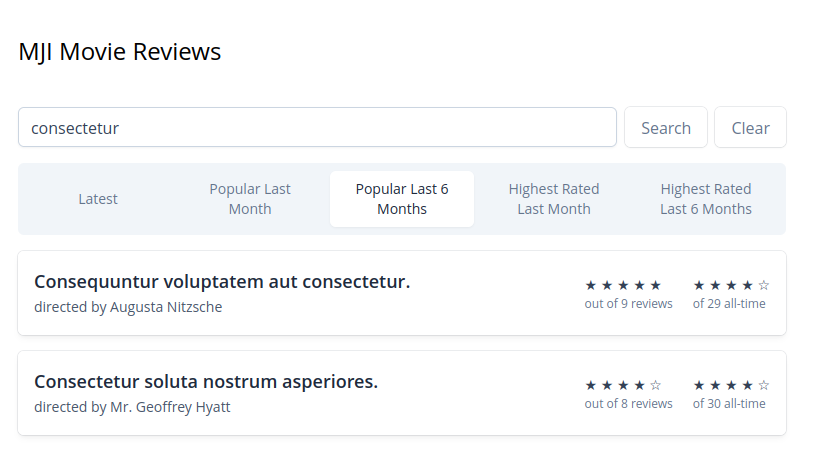

# MJI Movie Review

An example Laravel Movie Review application.

Started 2024-06-23

The course is building a book review app, and I've decided to change gears to a movie review app.
I want to show that I'm not copying the code verbatim. 

There are a few key differences with my version vs the instructors. One of which is my preference to show both the filtered and the total ratings simultaneously.

